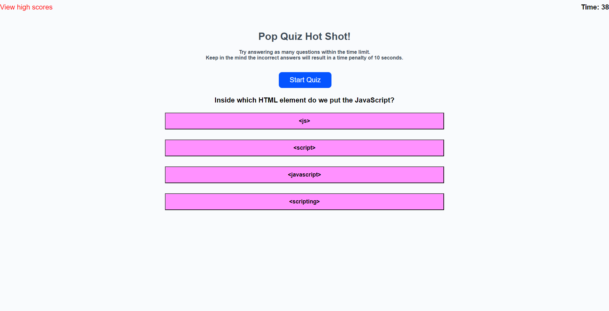

# PopQuiz!

## Description
A pop quiz with questions on javascript, with a timer and high scores 

## Table of Contents
- [Installation](#installation)
- [Usage](#usage)
- [License](#license)
- [Contributing](#contributing)
- [Testing](#testing)
- [Questions](#questions)

## Installation
Simply launch <a href="https://jako0320.github.io/JS-PopQuiz/">this link</a> in your browser

## Usage

## License

  
This application is covered under the None license. [License]( undefined )

  undefined

## Contributing
Please use as you see fit

## Testing
NA

## Questions
Please feel free to reach out for any questions:
- GitHub: https://github.com/jako0320
- Email: jacques.scoffoni@gmail.com
